# Hopper1x London 2019 : Azure Pipelines for Open Source Projects

In this hands-on workshop participants will create a continuous integration pipeline for Node.js code, using the Azure DevOps product.

## What is Azure DevOps ? 
Azure DevOps (previously Visual Studio Team Services / VSTS) is Microsoft's answer to DevOps, and is essentially a cloud service for collaborating on code development, from writing the first lines of code through to building it, testing it and deploying it to production.

Azure DevOps

This consists of the following components:

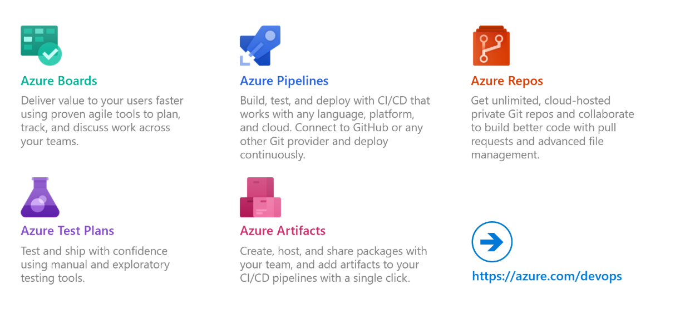

Git repositories for source control of your code
Build and release management to support continuous integration and delivery of your apps
Agile tools to support planning and tracking your work, code defects, and issues using Kanban and Scrum methods
A variety of tools to test your apps, including manual/exploratory testing, load testing, and continuous testing
Highly customisable dashboards for sharing progress and trends
Built-in wiki for sharing information with your team
In addition, the Azure DevOps ecosystem provides support for adding extensions, integrating with other popular services, such as: Campfire, Slack, Trello, UserVoice, and more, and developing your own custom extensions

## Getting started

Create an Azure account by browsing to https://azure.microsoft.com/en-us/free/.  Go to portal.azure.com and then Click on Cost Management and Billing on the left-hand panel. You should see your subscription name in the middle panel – it will be a long string of letters and numbers with hyphens between. Note this name somewhere. 

Go to dev.azure.com and create an account. 
Create a new project

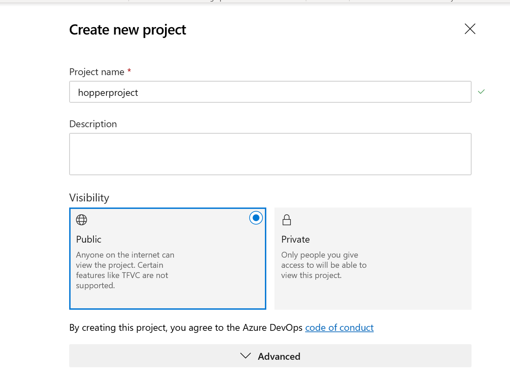

 
## Setup Azure DevOps organisations
- Name the project hopperproject
 
Now go to Project Settings using the button the bottom left. Scroll down the page and toggle the button to switch on the view of Repos
 
 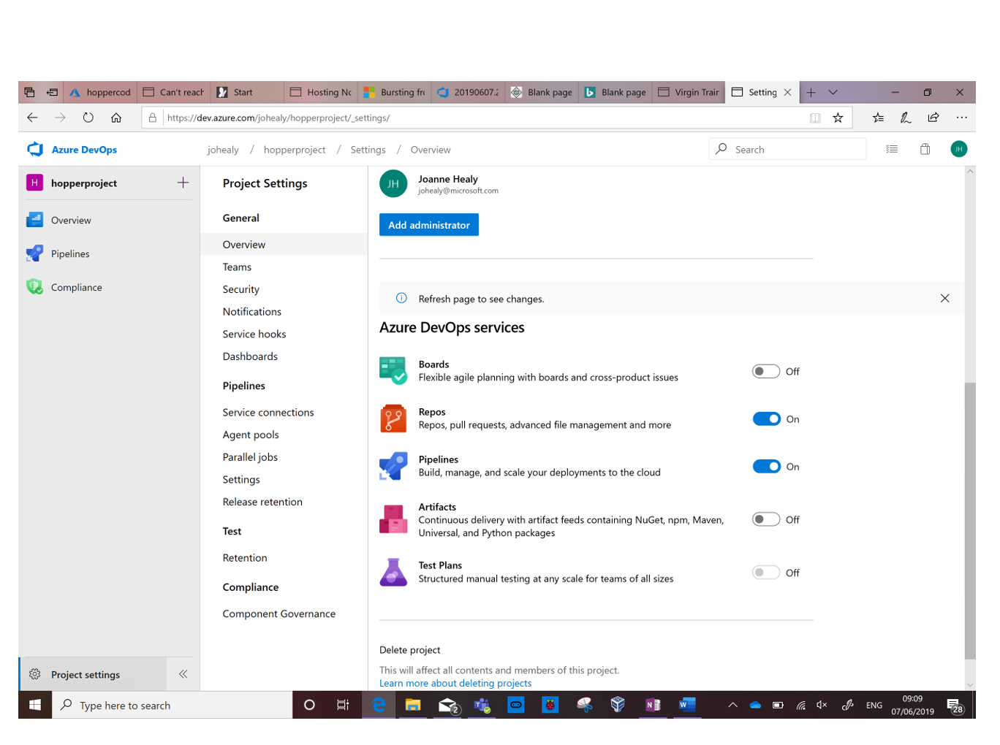

Press Overview (top left) to refresh the view and click Repos. Now you need to add some the code into the Azure DevOps repo. 

- Import a repository 
 
Enter the repository details as shown here, using the repo https://github.com/cloudmelon/hopperdemo.git and click Import

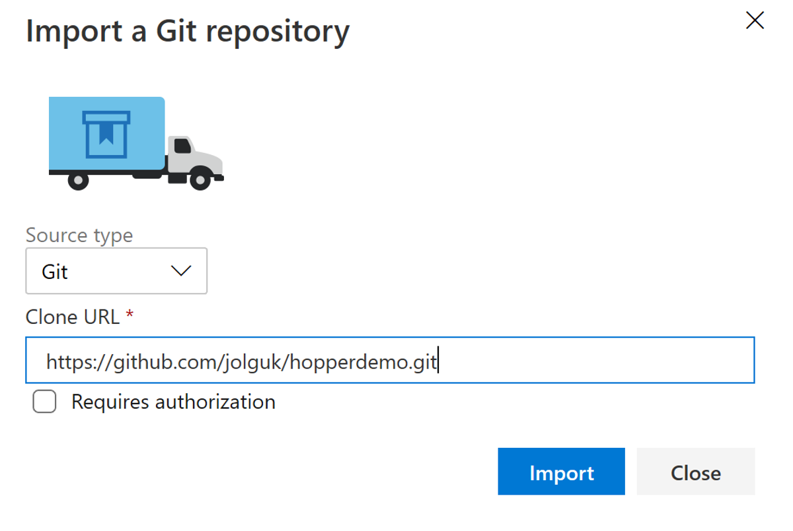
 
Wait a little while
 
Then you’ll see your code has imported into the Azure DevOps repository
 
 ## Setup service connection
Add a Service Connection. Go to Project Settings/Pipelines/Service Connections. Add a Service Connection, giving it the same name as your Subscription. 

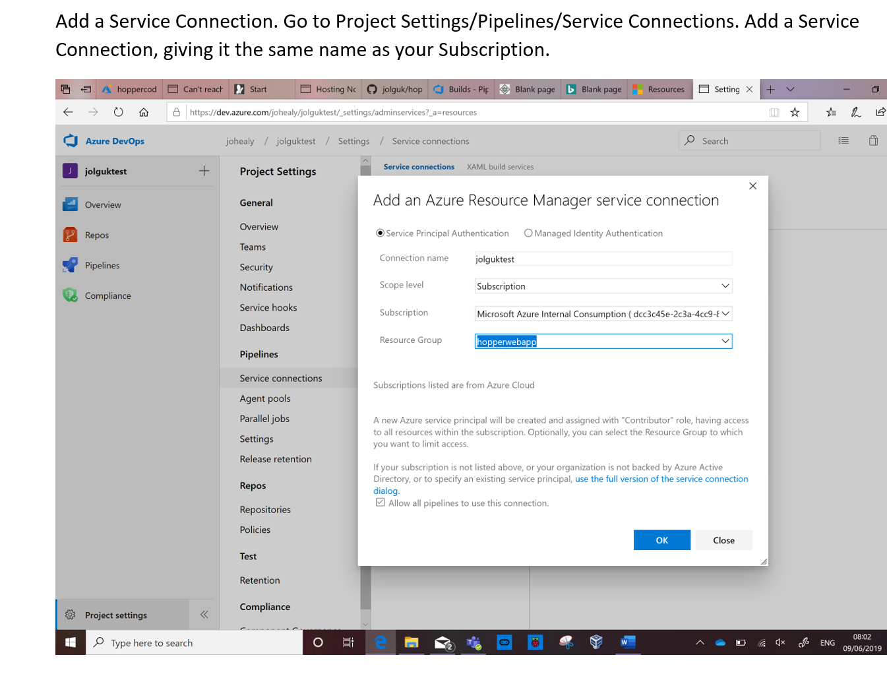
 

The codebase includes a yaml file which creates a Web App, also known as an App Service, in Azure. If you had wanted to do this manually, however, using a visual editor, we have created instructions to do this in the Appendix of this document. 

 ## End-to-end automation : Setup CI/CD pipeline with yaml definition file 
Now create a pipeline. This one is to build the code to deploy, and then to deploy it to the App Service.  Click Pipelines on the left, and then New Pipeline
 
- Select Azure Repos Git
 
Select your repository (hopperproject) and the tool will find the azure-pipelines.yaml file in there. 

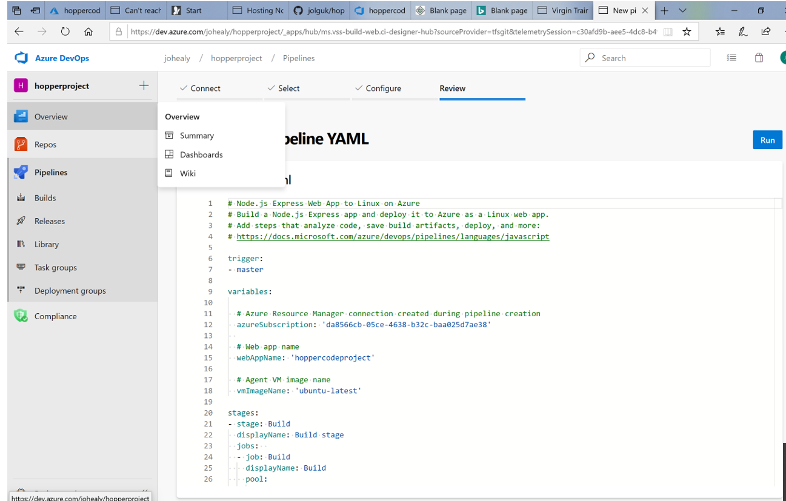
 
 ## Link up your variable group with CI/CD pipeline
Add a variable group. Within Pipelines go to Library, then click + Variable Group. Toggle on Allow access to all pipelines. Add 3 variables to the variable group (key/value pairs) as follows:

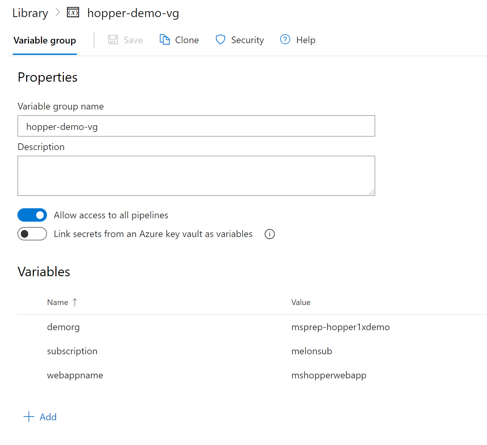

Now press Run and then Queue to run the pipeline. If you get an error message, ignore it and try again (this is some bug). 

Here are results possibly to show if you're using unified CI/CD yaml definition pipeline and create your CI/CD pipeline successfully:

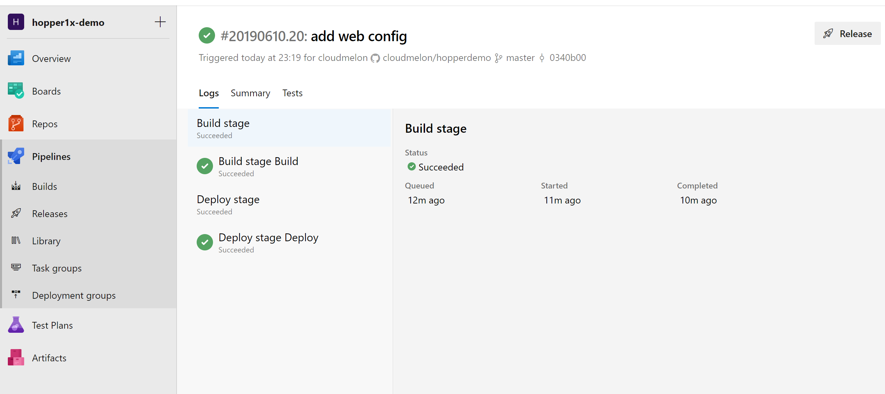

What we did so far, it is also possible to do it in another way byusing graphic designer. 

# The art of possible :  Using Grapic designer to set up CI/CD pipeline

Creating a Web App using the Visual Editor in Azure DevOps with an ARM template.

Now create a pipeline to create a Web App, also known as an App Service, in Azure. Click on Pipelines on the Left, then New at the top, and then New Build Pipeline. 

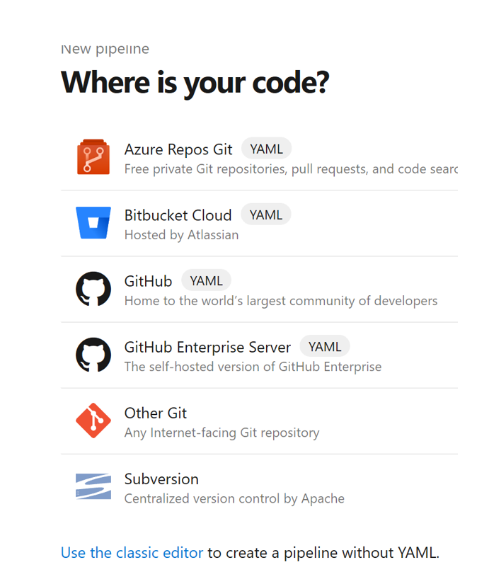
 

Select Use The Classic Editor to use the wizard-driven process for this pipeline. 
 
Press Continue on the next screen (leaving all the defaults)
Select Empty job
 
It’s a good idea to rename this pipeline to something more meaningful, so hover over the pipeline name at the top (it will currently end in ‘-ci’) and a pencil will appear. Change it to webappbuild
 
Click the + sign next to Agent job 1
Type ‘res’ in the search box on the top right and select Azure Resource Group Deployment. Press Add.

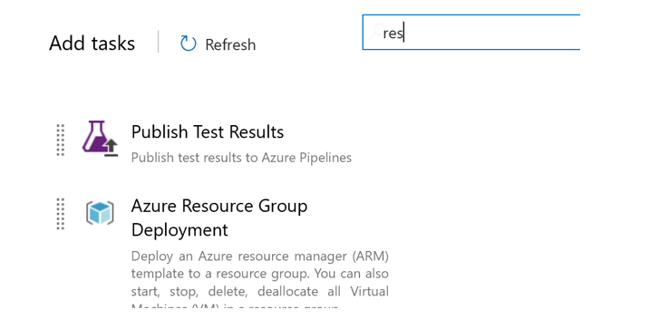
 

Click on the task, which now says ‘Some Settings Need Attention’ in red. Fill out the form to complete your subscription name, ‘hoppercodeproject’ for the webapp name, and UK South for the location. For Template click on the double dots to the right and select the path to the template webapp.json (yours will be a flatter path), and press OK.

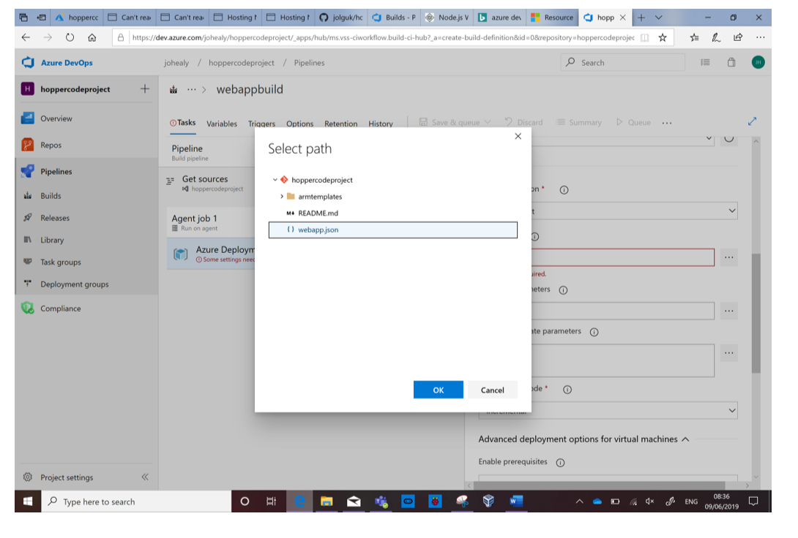
 

In the Override Parameters box, type
-webAppName hoppercodeproject -hostingPlanName hoppercodeproject-plan -appInsightsLocation "South Central US" -sku "F1 Free"
Select Save and Queue, then Save and Queue again (leaving other boxes default)
 
Click on the hyperlink to watch the build again. 

## Congratuations

Node.js application like below :

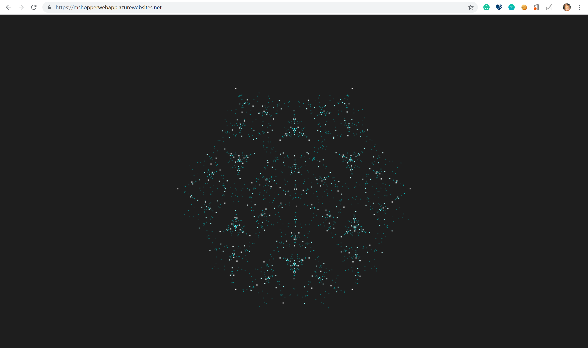

